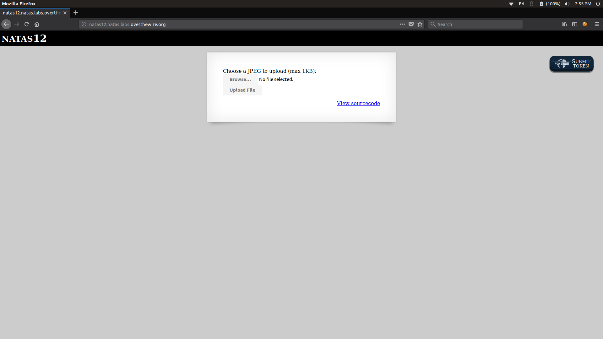
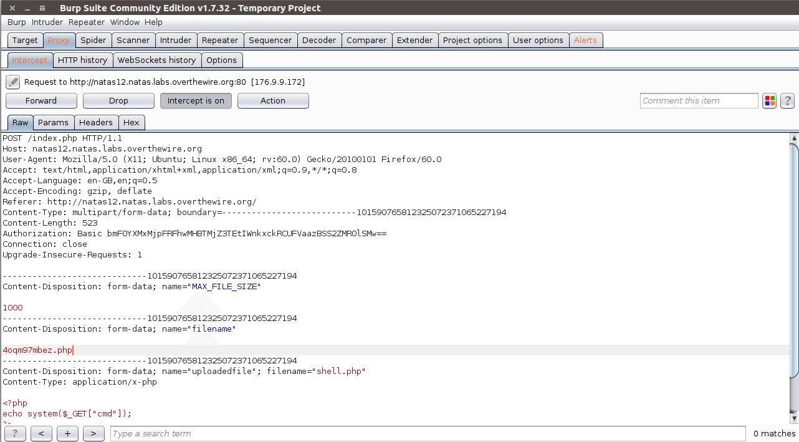
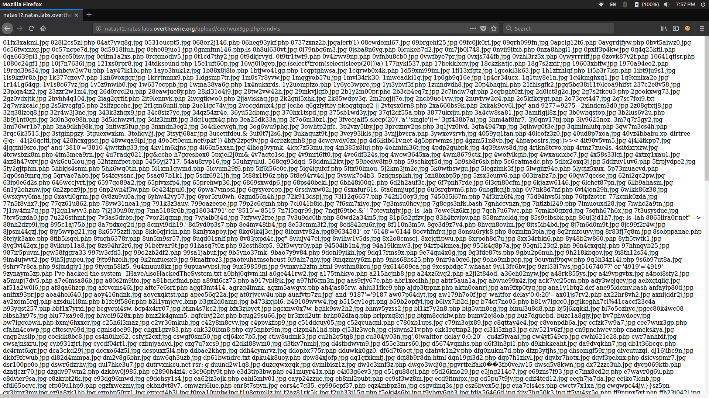

# File upload vulnerability

> Various web applications allow users to upload files (eg images, music files etc). The uploaded files can create momentous risk if not handled in a secure way. Depending on the how the file is processed and where it is stored the impact of the file upload vulnerability may vary.

There are two types forms of complications here. The first one is with the metadata, like the path and the file name. These are generally provided by the transport, such as HTTP multipart encoding. This data can be used to trap the application into overwriting a critical file or storing the file in a bad location. For example, the attacker can upload a file called index.php in the root folder by upload a malicious file and its filename might look like this “../../../index.php”. So you must validate the metadata extremely carefully before using it. The other type of problem with uploaded data comes from file content.

## Impact
- The attacker can get a web shell and execute various commands, browse system files and browse local resources etc.
- Make a phishing page in the website
- Make a permanent XSS in the website
- Uploaded sensitive files might be accessible by unauthorized people.
- Uploaded files might trigger vulnerabilities in broken libraries/applications on the client side.
- Uploaded files might trigger vulnerabilities in broken libraries/applications on the server side.
- Uploaded files might trigger vulnerabilities in broken real-time monitoring tools.

The impact of this vulnerability is high, a supposed code can be executed in the server context or on the client side. The likelihood of detection for the attacker is high. The prevalence is common. As a result, the severity of this type of vulnerability is high.
### Explore it yourself :
 Make a PHP file to test the vulnerability locally in your system with the code mentioned here.
 
  shell.php
```php
<?php
echo system($_GET["cmd"]);
?>
``` 

## Let's try a challenge

NATAS 12 :
 - USERNAME : natas12
 - PASSWORD : EDXp0pS26wLKHZy1rDBPUZk0RKfLGIR3 
 
 

You can see that we can upload a file here. Let's try to upload a file so that we can get a shell on the website.

Make the shell.php file. We can pass the commands through the URL.


Now let's upload the PHP file. But during the upload, we should change the .jpeg format to .php by intercepting the request.



Once you open the link generated by the site, we can start exploiting by giving the commands we desired. Once we get the shell we can do various things.

Let's try to find the files present in the directory where the image is uploaded by giving cmd=ls



we can see various files present in the directory on the screen (say jpg,PHP etc.) uploaded by other users for the challenge.

The password for the next level will be in the folder /etc/natas_webpass/
where natas12 is the file containing the password.

so...
```
.php?cmd=cat  /etc/natas_webpass/natas12
```

Gives the password: jmLTY0qiPZBbaKc9341cqPQZBJv7MQbY


 This is a basic example of File upload vulnerability.


